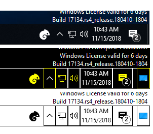

# tray-button

Adds a button on the task tray bar that does nothing.

Download: [tray-button.zip](https://github.com/stegru/tray-button/archive/master.zip)

## Known issues

* Doesn't know about vertical taskbars.
* Only tested with Windows 10.
